```python
import matplotlib.pyplot as plt
from scipy.stats import linregress
import pandas as pd
import numpy as np
```


```python
a=pd.read_csv('book1.csv')
testids=[1,2,3]
levels=['1st Year Resident', '2nd Year Resident', '3rd Year Resident','Expert']

```


```python
b=a.groupby('test_id')
for i in testids:
    c=b.get_group(i).groupby('user_level')
    try:
        for j in levels:
            d=c.get_group(j)
            e=d.groupby('sequence').sum()['correct']/d.groupby('sequence').count()['correct']
            x=e.index
            y=list(e)
            fit = np.polyfit(x,y,1)
            fit_fn = np.poly1d(fit) 
            plt.plot(x,y, 'yo', x, fit_fn(x), '--k')
            plt.xlabel('Case Sequence')
            plt.ylabel('Probability Correct')
            plt.title(f'{j} Test #{i}')
            plt.show()
            print(linregress(x,y))
    except:
        print(j)
        continue


```


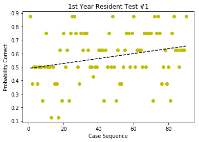


    LinregressResult(slope=0.0018425261202147237, intercept=0.48898252184769048, rvalue=0.25897282157646939, pvalue=0.013713095064240885, stderr=0.0007325602921567718)
    


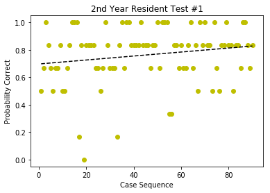


    LinregressResult(slope=0.0014542261733272968, intercept=0.69679567207657089, rvalue=0.18442978457992834, pvalue=0.081831263227500325, stderr=0.00082612335532316087)
    


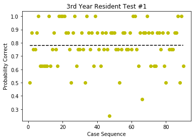


    LinregressResult(slope=2.2636539490472137e-05, intercept=0.77952559300873903, rvalue=0.0037113237321537815, pvalue=0.97230567802665768, stderr=0.0006501848863123249)
    


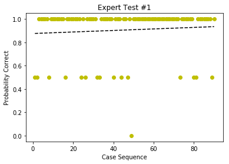


    LinregressResult(slope=0.00065440177799728377, intercept=0.87578027465667918, rvalue=0.081179245999815894, pvalue=0.44688092298004745, stderr=0.00085649014405909116)
    


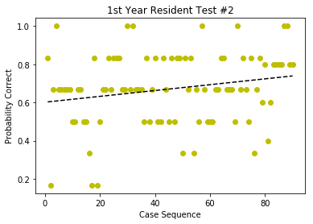


    LinregressResult(slope=0.0015269374819936617, intercept=0.60126508531002898, rvalue=0.21119513104933688, pvalue=0.045698734120503924, stderr=0.0007533345185577095)
    


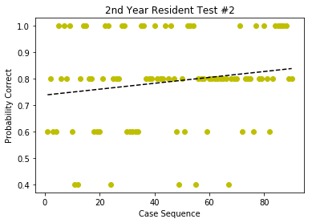


    LinregressResult(slope=0.0011145408898217885, intercept=0.73817727840199754, rvalue=0.16814234138930453, pvalue=0.11316150738390326, stderr=0.0006965462721025429)
    


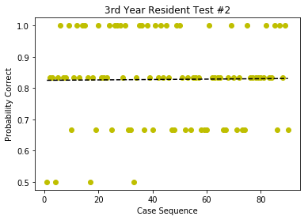


    LinregressResult(slope=6.4479839760738571e-05, intercept=0.8248439450686641, rvalue=0.01202253938233299, pvalue=0.91045428811077667, stderr=0.00057168265530508418)
    Expert
    


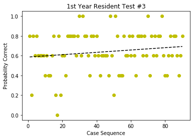


    LinregressResult(slope=0.0011820389348479235, intercept=0.58621722846441937, rvalue=0.15153471335378044, pvalue=0.15394424947666469, stderr=0.0008219281799724769)
    


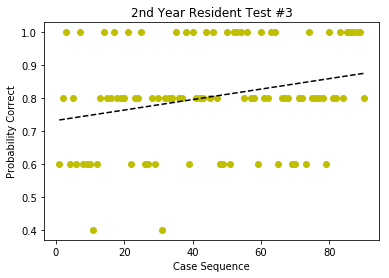


    LinregressResult(slope=0.0015903197925669836, intercept=0.73208489388264653, rvalue=0.2619866692711314, pvalue=0.012616510558336279, stderr=0.00062448702775646668)
    


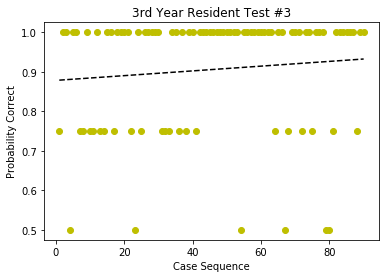


    LinregressResult(slope=0.00060089723011071323, intercept=0.8782147315855181, rvalue=0.1028793874860772, pvalue=0.33458488845478807, stderr=0.000619326871530559)
    Expert
    


```python
c=b.get_group(1).groupby('user_level')

```


```python
d=c.get_group('1st Year Resident')
```


```python
e=d.groupby('sequence').sum()['correct']/d.groupby('sequence').count()['correct']
```


```python
x=e.index
y=list(e)
fit = np.polyfit(x,y,1)
fit_fn = np.poly1d(fit) 
plt.plot(x,y, 'yo', x, fit_fn(x), '--k')
plt.xlabel('Closeness of Restaurants')
plt.ylabel('Average Price')
plt.title('Price versus Distance of Restaurant (Relative)')
plt.show()
print(linregress(x,y))
```


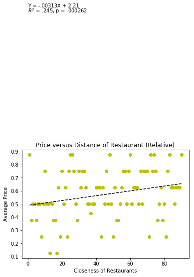


    LinregressResult(slope=0.0018425261202147237, intercept=0.48898252184769048, rvalue=0.25897282157646939, pvalue=0.013713095064240885, stderr=0.0007325602921567718)
    


```python
linregress(x,y)[4]
```


    0.0007325602921567718


