```python
import matplotlib.pyplot as plt
from scipy.stats import linregress
import pandas as pd
import numpy as np
import seaborn as sns
sns.set(color_codes=True)
```


```python
a=pd.read_csv('book1.csv')
testids=[1,2,3]
levels=['1st Year Resident', '2nd Year Resident', '3rd Year Resident','Expert']

```

# Linear Regression


```python
b=a.groupby('test_id')
for i in testids:
    c=b.get_group(i).groupby('user_level')
    try:
        for j in levels:
            d=c.get_group(j)
            e=d.groupby('sequence').sum()['correct']/d.groupby('sequence').count()['correct']
            x=e.index
            y=list(e)
            fit = np.polyfit(x,y,1)
            fit_fn = np.poly1d(fit) 
            plt.plot(x,y, 'go', x, fit_fn(x), '--k')
            plt.xlabel('Case Sequence')
            plt.ylabel('Probability Correct')
            plt.title(f'{j} Test #{i}')
            plt.show()
            print(linregress(x,y))
    except:
        print(j)
        continue


```


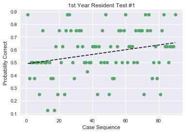


    LinregressResult(slope=0.0018425261202147237, intercept=0.48898252184769048, rvalue=0.25897282157646939, pvalue=0.013713095064240885, stderr=0.0007325602921567718)
    


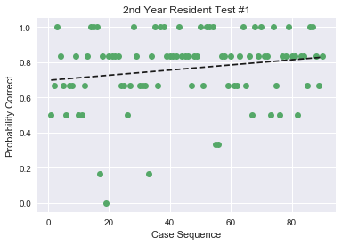


    LinregressResult(slope=0.0014542261733272968, intercept=0.69679567207657089, rvalue=0.18442978457992834, pvalue=0.081831263227500325, stderr=0.00082612335532316087)
    


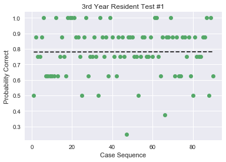


    LinregressResult(slope=2.2636539490472137e-05, intercept=0.77952559300873903, rvalue=0.0037113237321537815, pvalue=0.97230567802665768, stderr=0.0006501848863123249)
    


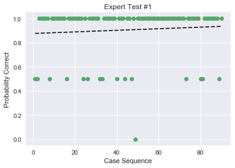


    LinregressResult(slope=0.00065440177799728377, intercept=0.87578027465667918, rvalue=0.081179245999815894, pvalue=0.44688092298004745, stderr=0.00085649014405909116)
    


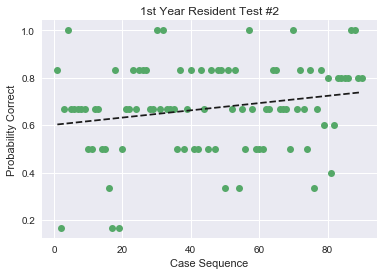


    LinregressResult(slope=0.0015269374819936617, intercept=0.60126508531002898, rvalue=0.21119513104933688, pvalue=0.045698734120503924, stderr=0.0007533345185577095)
    


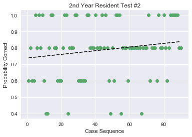


    LinregressResult(slope=0.0011145408898217885, intercept=0.73817727840199754, rvalue=0.16814234138930453, pvalue=0.11316150738390326, stderr=0.0006965462721025429)
    


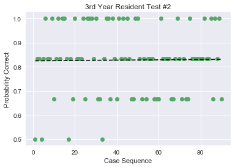


    LinregressResult(slope=6.4479839760738571e-05, intercept=0.8248439450686641, rvalue=0.01202253938233299, pvalue=0.91045428811077667, stderr=0.00057168265530508418)
    Expert
    


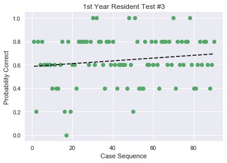


    LinregressResult(slope=0.0011820389348479235, intercept=0.58621722846441937, rvalue=0.15153471335378044, pvalue=0.15394424947666469, stderr=0.0008219281799724769)
    


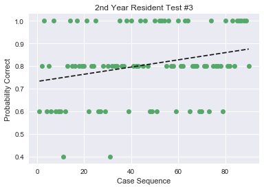


    LinregressResult(slope=0.0015903197925669836, intercept=0.73208489388264653, rvalue=0.2619866692711314, pvalue=0.012616510558336279, stderr=0.00062448702775646668)
    


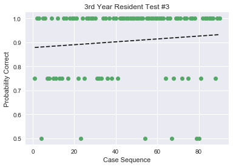


    LinregressResult(slope=0.00060089723011071323, intercept=0.8782147315855181, rvalue=0.1028793874860772, pvalue=0.33458488845478807, stderr=0.000619326871530559)
    Expert
    

# Linear Regression of Rolling Average of 5


```python
b=a.groupby('test_id')
for i in testids:
    c=b.get_group(i).groupby('user_level')
    try:
        for j in levels:
            d=c.get_group(j)
            e=d.groupby('sequence').sum()['correct']
            averages=[]
            for k in range(len(e)-5):
                averages.append(sum(e[k:k+5])/5)
            averages
            ind=[]
            for k in range(len(averages)):
                ind.append(k)
            x=ind
            y=averages
            fit = np.polyfit(x,y,1)
            fit_fn = np.poly1d(fit) 
            plt.plot(x,y, 'go', x, fit_fn(x), '--k')
            plt.xlabel('Case Sequence')
            plt.ylabel('Probability Correct')
            plt.title(f'{j} Test #{i} Rolling Averages')
            plt.show()
            print(linregress(x,y))
    except:
        print(f'{j} Test #{i}')
        continue
```


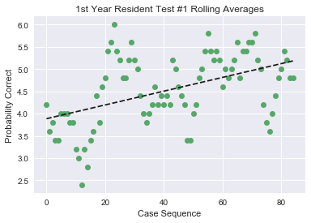


    LinregressResult(slope=0.015458276333789323, intercept=3.8848700410396719, rvalue=0.48514501506852542, pvalue=2.5308958657533536e-06, stderr=0.0030582806644757561)
    


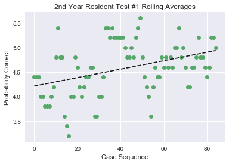


    LinregressResult(slope=0.0086066054328708223, intercept=4.2149931600547195, rvalue=0.39713314956510004, pvalue=0.00016776839817548786, stderr=0.0021831637309209003)
    


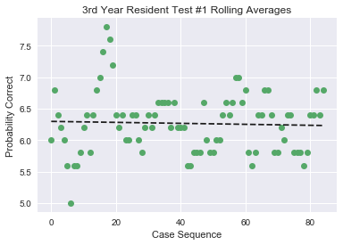


    LinregressResult(slope=-0.00077389095172952956, intercept=6.2983857729138153, rvalue=-0.039036422452539243, pvalue=0.72281098277313838, stderr=0.0021744006186428613)
    


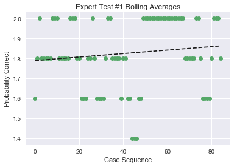


    LinregressResult(slope=0.00087160445573578223, intercept=1.789274965800274, rvalue=0.12562895818318159, pvalue=0.2519449577718742, stderr=0.00075550292287201743)
    


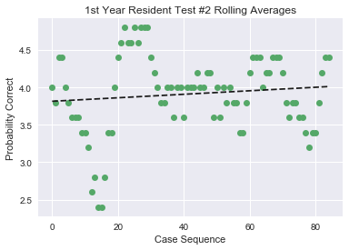


    LinregressResult(slope=0.002341215555989839, intercept=3.8146101231190146, rvalue=0.11082591607576617, pvalue=0.31261485415680601, stderr=0.0023045037804087466)
    


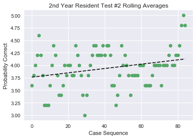


    LinregressResult(slope=0.0043384795778776625, intercept=3.761313269493844, rvalue=0.27814999633392939, pvalue=0.0099510507315947738, stderr=0.0016444998787725148)
    


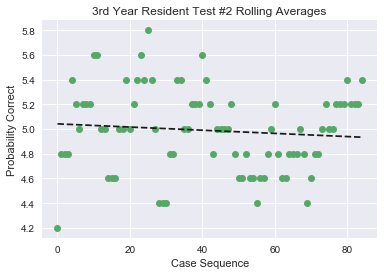


    LinregressResult(slope=-0.0012859097127222979, intercept=5.0422435020519831, rvalue=-0.094934966681496244, pvalue=0.38744947841962407, stderr=0.0014800598718572324)
    Expert Test #2
    


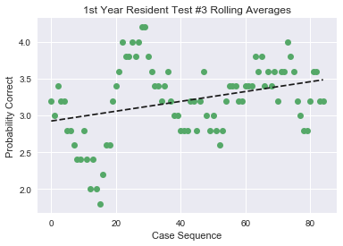


    LinregressResult(slope=0.0066640609732264997, intercept=2.9248153214774284, rvalue=0.32497094378621327, pvalue=0.0024090300090980287, stderr=0.0021287261486617839)
    


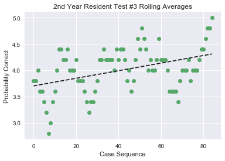


    LinregressResult(slope=0.0072151651358217713, intercept=3.7040218878248981, rvalue=0.42488668665348267, pvalue=5.055019996437606e-05, stderr=0.0016873337019479443)
    


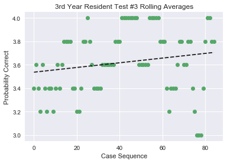


    LinregressResult(slope=0.0020050811022083253, intercept=3.5369630642954863, rvalue=0.18039165686549732, pvalue=0.098516742536878449, stderr=0.0012000316516799781)
    Expert Test #3
    
